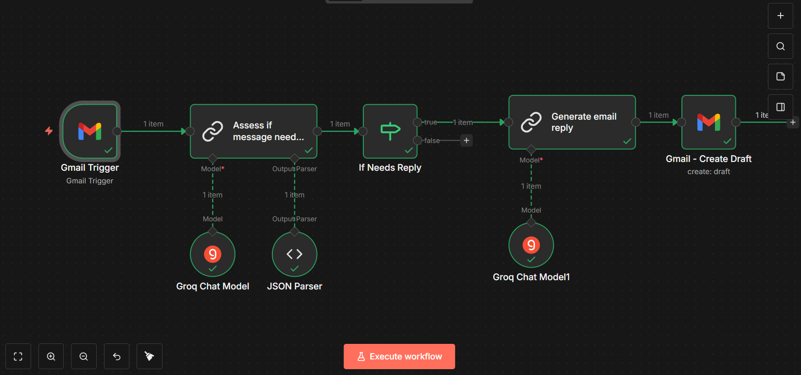

# AI Email Automation System (n8n)

## 🚀 Overview

AI-powered workflow that automatically reads incoming emails, identifies if a reply is needed, and generates professional draft responses using LLMs.

This system helps professionals automate repetitive email responses and improve productivity.

---

## 🧠 Key Features

* 📩 Real-time Gmail monitoring
* 🤖 AI-based email classification using LLM
* ✉️ Automated professional reply generation
* 🔀 Conditional decision workflow
* 📄 Draft replies created automatically in Gmail

---

## 🛠 Tech Stack

* n8n (Workflow Automation)
* LLaMA 3.1 (Groq API)
* Gmail API
* JSON Parsing

---

## ⚙️ Workflow Architecture

1. Gmail Trigger → Fetch incoming emails
2. AI Classification → Check if reply is needed
3. Conditional Logic → Filter emails
4. AI Reply Generator → Draft response
5. Gmail API → Create draft reply

---

## 📊 Impact

* Reduced manual email handling effort by ~70%
* Automated repetitive communication workflows

---

## 🖼 Workflow Screenshot

---

## ▶️ How to Use

1. Import the JSON file into n8n
2. Connect Gmail API credentials
3. Add Groq API key
4. Activate the workflow

---

## ⚠️ Note

Draft replies are generated for review to ensure accuracy and context before sending.

---

## 📁 Project File

* `gmail-ai-auto-responder.json` → Import into n8n

---

## 👨‍💻 Author

Muhammed Fahim M
